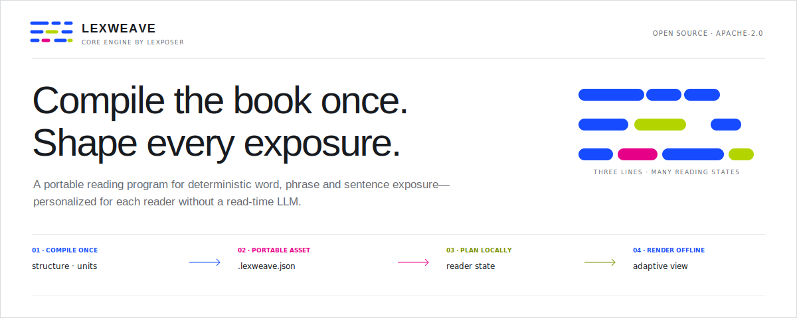
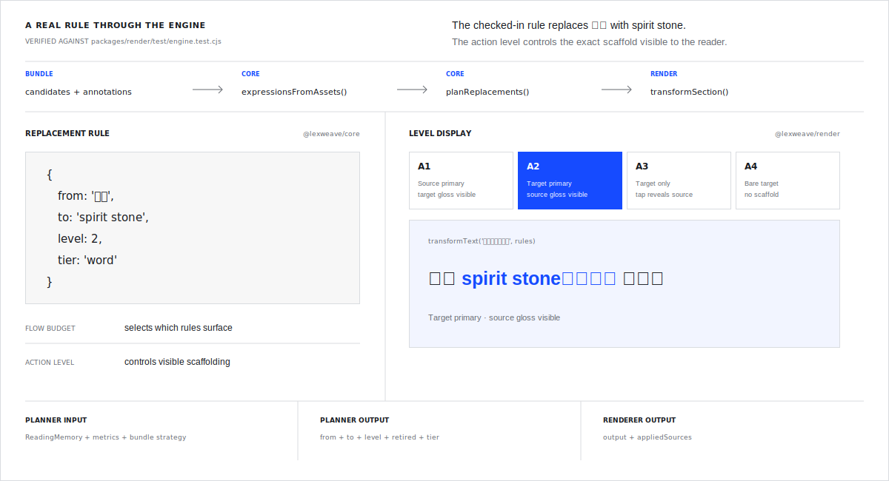
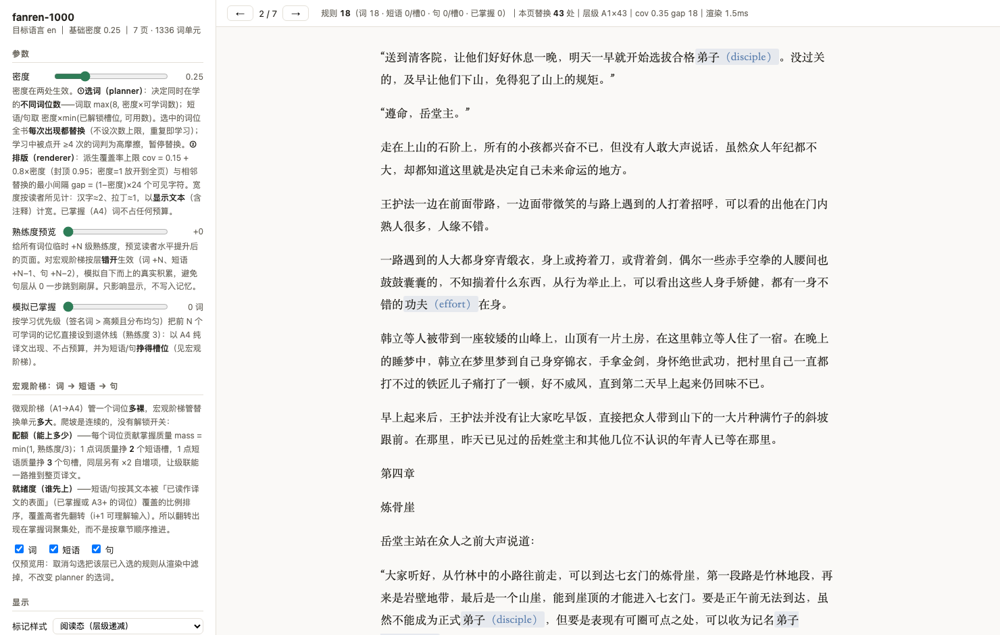
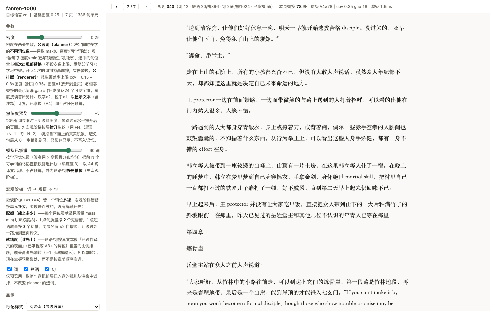

<div align="center">



[Quickstart](#quickstart) · [Architecture](#how-it-works) · [Packages](#packages) · [Live playground](https://lexweave-hq.github.io/lexweave/) · [GitHub](https://github.com/lexweave-hq/lexweave)

[](https://github.com/lexweave-hq/lexweave/actions/workflows/ci.yml)
[](https://www.npmjs.com/package/lexweave)
[](./LICENSE)
[](https://nodejs.org)

</div>

Lexweave is an open engine for **adaptive exposure substitution** — the modern,
adaptive version of the classic [diglot weave](https://en.wikipedia.org/wiki/Diglot_weave)
method. It compiles long-form text into a portable reading program **once**,
then plans deterministic word, phrase, and sentence exposure for each reader
without a read-time LLM.

Compile time produces verified, verbatim units and a shareable
`.lexweave.json` asset. Read time combines that asset with reader state and a
flow budget; the same source, bundle, reader state, and parameters produce the
same adaptive view.

## A real rule through the engine



The specimen above uses the checked-in `灵石` → `spirit stone` rule. The A1–A4
display strings and the rendered spacing are asserted in
[`packages/render/test/engine.test.cjs`](./packages/render/test/engine.test.cjs);
the graphic does not imply an untested output.

## Choose the boundary your product needs

Start from the input object your product already owns. Each row names the
minimum package surface and the output you can inspect.

| Starting object | Package surface | Verifiable output |
|---|---|---|
| Raw long-form text | `@lexweave/compile` + `@lexweave/core` + `@lexweave/render` | Portable bundle, replacement plan, and rendered text |
| Verified annotations | `@lexweave/core` + `@lexweave/render` | Reader state, deterministic rules, and rendered text |
| Known replacement rules | `@lexweave/render` | Transformed HTML or plain text plus `appliedSources` |
| A repository checkout | `lexweave` CLI | Compiled bundle, HTML reader, and inspection output |

## A reading engine, not a text highlighter

| Naive bilingual readers | Lexweave |
|---|---|
| Replace generic frequent words → reads like a fake accent | Replace the book's **signature vocabulary** (keyness, not frequency) — the coined terms that repeat for hundreds of pages |
| One fixed difficulty for everyone | **Three independent adaptive axes**: density (flow budget from live reading signals) · scaffolding (per-word A1→A4 ladder) · unit tier (word → phrase → sentence) |
| Can obscure a clue or plot twist | **Plot-critical words are capped** to heavily-glossed levels — the reader never loses the thread |
| LLM call per page per reader | **Compile once, render many** — reading never calls a model; cost is `O(book)`, not `O(readers × pages)` |

## How it works

```text
                    COMPILE TIME · LLM ONCE
book.txt ──► extract + verify units ──► .lexweave.json
             words · phrases ·          portable asset
             sentences · risk

                    READ TIME · LOCAL + OFFLINE
.lexweave.json + reader state ──► planner ──► renderer ──► adaptive view
                                  │           │
                                  │           └─ output + appliedSources
                                  └─ from + to + level + retired + tier
```

Every extracted unit is a **verbatim span** located in the book by exact
substring match. The same contract works for a word, phrase, or sentence.
Learner state lives outside the portable bundle: the book asset is shareable;
the reader's memory remains a separate object. See the
[`Bundle` format specification](./packages/core/BUNDLE_SPEC.md).

## Quickstart

```bash
git clone https://github.com/lexweave-hq/lexweave && cd lexweave
npm install && npm run build

# compile your own book with a real model
export ANTHROPIC_API_KEY=sk-...
node packages/cli/dist/lexweave.cjs compile book.txt --source zh --target en -o book.lexweave.json
node packages/cli/dist/lexweave.cjs render  book.txt --bundle book.lexweave.json -o book.html
node packages/cli/dist/lexweave.cjs inspect book.lexweave.json
```

Providers: `--provider anthropic` (default) · `openai` · `mock` (offline,
glossary-driven — used by deterministic tests).

### Debug playground

**[▶ Try it live](https://lexweave-hq.github.io/lexweave/)** — a slice of the
real `lexweave-cli-openai@1` compile of 凡人修仙传, beginning at chapter 131.
The published HTML contains the complete first 1,000 chapters, the matching
word layer from the full-book bundle, and 34 human-reviewed terminology
corrections. The lower-confidence phrase and sentence layers remain in the
compiled bundle but are excluded from the browser payload.

One self-contained HTML page with every knob of the engine live: density,
mastery preview, simulated-mastered words, the word → phrase → sentence ramp
(with per-tier switches and earned-slot quotas), A1→A4 scaffold styles, gloss
styles (brackets / inline / ruby), and the active rule table — all driven by
the **real** planner + renderer bundled inline, so what you see is exactly
what the CLI and an embedding app render. The sidebar documents each
mechanism next to its slider.

The checked-in page is generated from the local 凡人修仙传 source, bundle, and
reviewed glossary. `--include-tiers word` keeps the browser payload responsive
without cutting the book text:

```bash
node scripts/debug-render.mjs books/fanren-1000.txt \
  --bundle books/fanren-1000.lexweave.json \
  --glossary books/fanren-glossary.json \
  --include-tiers word \
  --default-phrases off --default-sentences off \
  --title '凡人修仙传 · 前一千章' \
  -o docs/index.html
```

Generated pages stay local by design (`books/` is gitignored — book files are
never committed). Every control round-trips through the URL
(`?density=0.4&mastery=2&style=debug&gloss=inline`), so a specific
configuration is one link to share.

## Case study: a 1000-chapter novel

The engine's stress corpus is 凡人修仙传 (*A Record of a Mortal's Journey to
Immortality*) — the first **1000 chapters: 2.82M characters, 86,627
segments**, compiled once into a full-translation substrate:

| | |
|---|---|
| Compile | `--full` + OpenAI Batch API (50% token price) · 13.9M tokens · interrupted and **resumed from checkpoints**, finishing at 86,627/86,627 segments translated, 0 failed batches |
| Assets | **89,584 verbatim units** — 85,441 sentence frames · 2,719 phrases · 1,139 terms · 285 names (kept in source) |
| Strategy | LLM-designed base density 0.25 for a fresh reader |
| Quality gate | every unit scored; 15 source-echo · 117 length-anomaly · 1 marker-loss flagged for review — nothing silently dropped |

Below, the debug playground running that bundle (short excerpts shown for
demonstration; the novel belongs to its author — book files never enter this
repo). A fresh reader sees the book's signature vocabulary surface fully
glossed at A1:



The same page, previewing a reader further along (`+3` mastery, 60 words
mastered): glosses have faded to bare target words (A4), and the tier ramp —
fed by those mastered words — has begun flipping **whole sentences** into
English (256 sentence frames admitted against 1,024 earned slots):



The **same Fanren playground runs live** at
[lexweave-hq.github.io/lexweave](https://lexweave-hq.github.io/lexweave/).

## Packages

| Package | What it is | Dependencies |
|---|---|---|
| [`@lexweave/core`](./packages/core) | The engine: language-unit model, bundle format, flow budget, action-level policy, replacement planner, learner state | `zod` |
| [`@lexweave/compile`](./packages/compile) | The compiler: chunking, verbatim-span scanning, LLM job specs (prompts + JSON schemas), pass orchestration — behind one `LexweaveLlm` port | `core` |
| [`@lexweave/render`](./packages/render) | The renderer: deterministic replacement injection into HTML or plain text with spatial density control | zero |
| [`lexweave`](./packages/cli) | CLI: `compile` / `render` / `inspect` with Anthropic, OpenAI, and offline mock providers | all |

## Embedding in your own app

```ts
import {compileText} from '@lexweave/compile'          // your LLM behind one port
import {expressionsFromAssets, planReplacements,
        createReadingMemory, recordInteraction} from '@lexweave/core'
import {createReplacementEngine, densityRenderOptions} from '@lexweave/render'

// once per book
const {bundle} = await compileText(
  {rawText, sourceLanguage: 'zh', targetLanguage: 'en'},
  {llm: myLlmAdapter}
)

// per reader, per render — no LLM
const {expressions} = expressionsFromAssets(bundle.candidates, bundle.annotations)
const rules = planReplacements(expressions, sessionState, {budget: {density: 0.55}})
const engine = createReplacementEngine({rules, ...densityRenderOptions(0.55)})
const {output, appliedSources} = engine.transformSection(chapterHtml)
// feed appliedSources + taps back via recordInteraction → the next render adapts
```

The `LexweaveLlm` port is one interface. Implement it with a direct API call,
an edge function, a queue, or a local model — the prompts and JSON schemas
ship in `@lexweave/compile`, so every adapter behaves identically. The render
engine is dependency-free and runs in browsers, WebViews, and Node — the same
module powers a production React Native EPUB reader.

## FAQ

**Is the learning method real?**
Lexweave operationalizes the *diglot weave* technique and Krashen-style
comprehensible input: high-repetition, story-driven exposure with scaffolding
that fades per word as mastery accrues. The engine also instruments the loop
(tap-to-reveal friction, reading speed, backtracks) so the density adapts to
the reader instead of following a fixed curriculum.

**What about copyrighted books?**
Lexweave is a neutral tool, like ffmpeg. Bundles contain offsets, stats, and
translations of extracted units — not the book text — but a bundle for a
copyrighted work is still a derivative asset: keep it for personal use, or
work with the rights holder. Keep source text and derived artifacts within the
permissions granted for the work.

**Why does reading never call an LLM?**
Cost and latency both collapse the product if reading scales with model calls.
One compile is `O(book tokens)`; after that any number of readers render any
number of times offline, including on-device.

**Which languages work?**
The pipeline is language-agnostic by design; the bundled heuristics
(segmentation, stopwords, spacing) are strongest for Chinese → English today.
Contributions for other pairs are very welcome.

## Roadmap

- [x] Whole-sentence flipping — shipped as the full-translation substrate
      (`compile --full`) + continuous word → phrase → sentence tier ramp with
      readiness (i+1) ordering, instead of a binary "A5 sweep" (0.2.0, refined 0.3.0)
- [ ] EPUB input in the CLI
- [ ] Browser-extension render target (any web novel → learning edition)
- [ ] Spaced-repetition export (review cards from learner state)
- [ ] More language pairs

## Contributing & community

- [CONTRIBUTING.md](./CONTRIBUTING.md) — dev setup, tests, DCO
- [SECURITY.md](./SECURITY.md) — private vulnerability reporting
- Bugs & ideas → [issues](https://github.com/lexweave-hq/lexweave/issues)

## License

Code: [Apache-2.0](./LICENSE). Name & logo: see
[TRADEMARK_POLICY.md](./TRADEMARK_POLICY.md) — build anything with the code,
including commercial products; just don't call your product "Lexweave".

---

<div align="center">
<sub>Lexweave is an open-source engine for progressively bilingual reading —
diglot weave · graded readers · comprehensible input · language learning
through novels.</sub>
</div>
