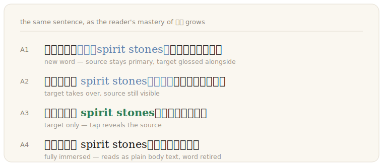

<div align="center">


**Turn any long-form text into a progressively bilingual learning edition.**

[](https://github.com/lexweave-hq/lexweave/actions/workflows/ci.yml)
[](https://www.npmjs.com/package/lexweave)
[](./LICENSE)
[](https://nodejs.org)

*Read the story you already love. Absorb the language you want.*

</div>

---

Lexweave is an open engine for **adaptive exposure substitution** — the modern,
adaptive version of the classic [diglot weave](https://en.wikipedia.org/wiki/Diglot_weave)
method. It compiles a novel (or any long text) into a structured asset **once**,
then renders a personalized **graded reader** for every reader at read time:
the book's own signature vocabulary is woven into the target language,
progressively, at a density each reader can actually sustain.

<div align="center">

</div>

The reader keeps chasing the story. The engine controls the exposure. Every
exposure updates the learner state. The next render adapts. That is the whole
loop — **comprehensible input (i+1), operationalized**.

## Why this is not "sprinkle foreign words into text"

| Naive bilingual readers | Lexweave |
|---|---|
| Replace generic frequent words → reads like a fake accent | Replace the book's **signature vocabulary** (keyness, not frequency) — the coined terms that repeat for hundreds of pages |
| One fixed difficulty for everyone | **Three independent adaptive axes**: density (flow budget from live reading signals) · scaffolding (per-word A1→A4 ladder) · unit tier (word → phrase → sentence) |
| Can obscure a clue or plot twist | **Plot-critical words are capped** to heavily-glossed levels — the reader never loses the thread |
| LLM call per page per reader | **Compile once, render many** — reading never calls a model; cost is `O(book)`, not `O(readers × pages)` |

## Quickstart

```bash
git clone https://github.com/lexweave-hq/lexweave && cd lexweave
npm install && npm run build

# 60-second offline demo — no API key needed
npm run demo
open examples/demo/sample-book.html   # tap any highlighted word

# compile your own book with a real model
export ANTHROPIC_API_KEY=sk-...
node packages/cli/dist/lexweave.cjs compile book.txt --source zh --target en -o book.lexweave.json
node packages/cli/dist/lexweave.cjs render  book.txt --bundle book.lexweave.json -o book.html
node packages/cli/dist/lexweave.cjs inspect book.lexweave.json
```

Providers: `--provider anthropic` (default) · `openai` · `mock` (offline,
glossary-driven — used by the demo and CI).

### Debug playground

One self-contained HTML page with every knob of the engine live: density,
mastery preview, simulated-mastered words, the word → phrase → sentence ramp
(with per-tier switches and earned-slot quotas), A1→A4 scaffold styles, gloss
styles (brackets / inline / ruby), and the active rule table — all driven by
the **real** planner + renderer bundled inline, so what you see is exactly
what the CLI and an embedding app render. The sidebar documents each
mechanism next to its slider.

```bash
npm run demo:debug
open examples/demo/sample-book-debug.html
```

Point it at your own compiled book — e.g. a 凡人修仙传 (first 1000 chapters,
~8M chars) full-translation substrate; `--slice-chars` keeps the page snappy
by cutting a paragraph-aligned slice and its matching units:

```bash
node scripts/debug-render.mjs books/fanren-1000.txt \
  --bundle books/fanren-1000.lexweave.json \
  --slice-chars 40000 -o books/fanren-1000-debug.html
```

Generated pages stay local by design (`books/` is gitignored — book files are
never committed). Every control round-trips through the URL
(`?density=0.4&mastery=2&style=debug&gloss=inline`), so a specific
configuration is one link to share.

## How it works

```
                 COMPILE TIME (LLM, once per book)
 book.txt ──► chunk ──► extract reading units ──► verbatim scan ──► book.lexweave.json
                        (word / phrase / sentence   (real frequency,     candidates
                         + translation + risk        dispersion,         occurrences
                         + plot-criticality)         exact offsets)      annotations
                                                                         strategy
                 READ TIME (no LLM, per reader, offline)
 learner state ──► flow budget ──► replacement plan ──► deterministic renderer
 (per-word mastery,  (density from   (which words, at     (HTML/text transform,
  friction, speed)    live signals)   which A-level)       coverage + min-gap)
```

Every extracted unit is a **verbatim span** — located in the book by exact
substring match. The same contract works for a single word and a whole
sentence, so there are no templates and no alignment models. The compile
artifact is a portable JSON bundle ([format spec](./packages/core/BUNDLE_SPEC.md));
learner state deliberately lives outside it — the book asset is shareable,
the reader's memory is theirs.

## Packages

| Package | What it is | Dependencies |
|---|---|---|
| [`@lexweave/core`](./packages/core) | The engine: language-unit model, bundle format, flow budget, action-level policy, replacement planner, learner state | `zod` |
| [`@lexweave/compile`](./packages/compile) | The compiler: chunking, verbatim-span scanning, LLM job specs (prompts + JSON schemas), pass orchestration — behind one `LexweaveLlm` port | `core` |
| [`@lexweave/render`](./packages/render) | The renderer: deterministic replacement injection into HTML or plain text with spatial density control | zero |
| [`lexweave`](./packages/cli) | CLI: `compile` / `render` / `inspect` with Anthropic, OpenAI, and offline mock providers | all |

## Embedding in your own app

```ts
import {compileText} from '@lexweave/compile'          // your LLM behind one port
import {expressionsFromAssets, planReplacements,
        createReadingMemory, recordInteraction} from '@lexweave/core'
import {createReplacementEngine, densityRenderOptions} from '@lexweave/render'

// once per book
const {bundle} = await compileText(
  {rawText, sourceLanguage: 'zh', targetLanguage: 'en'},
  {llm: myLlmAdapter}
)

// per reader, per render — no LLM
const {expressions} = expressionsFromAssets(bundle.candidates, bundle.annotations)
const rules = planReplacements(expressions, sessionState, {budget: {density: 0.55}})
const engine = createReplacementEngine({rules, ...densityRenderOptions(0.55)})
const {output, appliedSources} = engine.transformSection(chapterHtml)
// feed appliedSources + taps back via recordInteraction → the next render adapts
```

The `LexweaveLlm` port is one interface. Implement it with a direct API call,
an edge function, a queue, or a local model — the prompts and JSON schemas
ship in `@lexweave/compile`, so every adapter behaves identically. The render
engine is dependency-free and runs in browsers, WebViews, and Node — the same
module powers a production React Native EPUB reader.

## FAQ

**Is the learning method real?**
Lexweave operationalizes the *diglot weave* technique and Krashen-style
comprehensible input: high-repetition, story-driven exposure with scaffolding
that fades per word as mastery accrues. The engine also instruments the loop
(tap-to-reveal friction, reading speed, backtracks) so the density adapts to
the reader instead of following a fixed curriculum.

**What about copyrighted books?**
Lexweave is a neutral tool, like ffmpeg. Bundles contain offsets, stats, and
translations of extracted units — not the book text — but a bundle for a
copyrighted work is still a derivative asset: keep it for personal use, or
work with the rights holder. The demo and our test corpus use original and
public-domain text.

**Why does reading never call an LLM?**
Cost and latency both collapse the product if reading scales with model calls.
One compile is `O(book tokens)`; after that any number of readers render any
number of times offline, including on-device.

**Which languages work?**
The pipeline is language-agnostic by design; the bundled heuristics
(segmentation, stopwords, spacing) are strongest for Chinese → English today.
Contributions for other pairs are very welcome.

## Roadmap

- [ ] A5 whole-sentence sweep (progressively flip full sentences)
- [ ] EPUB input in the CLI
- [ ] Browser-extension render target (any web novel → learning edition)
- [ ] Spaced-repetition export (review cards from learner state)
- [ ] More language pairs

## Contributing & community

- [CONTRIBUTING.md](./CONTRIBUTING.md) — dev setup, tests, DCO
- [SECURITY.md](./SECURITY.md) — private vulnerability reporting
- Bugs & ideas → [issues](https://github.com/lexweave-hq/lexweave/issues)

## License

Code: [Apache-2.0](./LICENSE). Name & logo: see
[TRADEMARK_POLICY.md](./TRADEMARK_POLICY.md) — build anything with the code,
including commercial products; just don't call your product "Lexweave".

---

<div align="center">
<sub>Lexweave is an open-source engine for progressively bilingual reading —
diglot weave · graded readers · comprehensible input · language learning
through novels.</sub>
</div>
